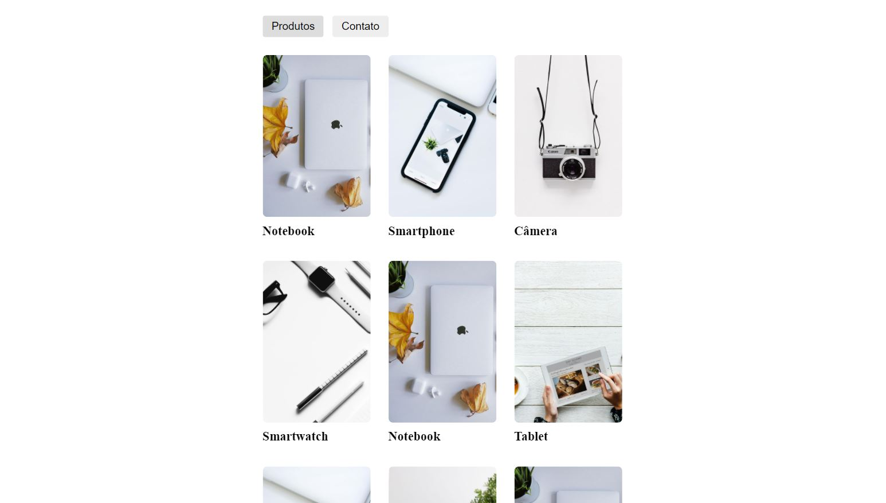

<h1 align="center">
    
</h1>

<p align="center">
  <a href="#-project">Project</a>&nbsp;&nbsp;&nbsp;|&nbsp;&nbsp;&nbsp;
  <a href="#-technologies">Technologies</a>&nbsp;&nbsp;&nbsp;|&nbsp;&nbsp;&nbsp;
  <a href="#-how-to-run">How to run</a>
</p>

<p align="center">
  
</p>

## 💻 Project

Ranek is a mini product portfolio developed with React fetching data from an API.

## 🔧 Technologies

- [React](https://reactjs.org/)

## 😊 How to run

Before starting, you need to have [Git](https://git-scm.com) and [Node](https://nodejs.org/en/) installed on your machine.

```sh
- Clone this repo:
$ git clone

- Enter directory:
$ cd ranek-react

- Install dependencies:
$ npm install

- Launch the app:
$ npm start
```

Have fun!
